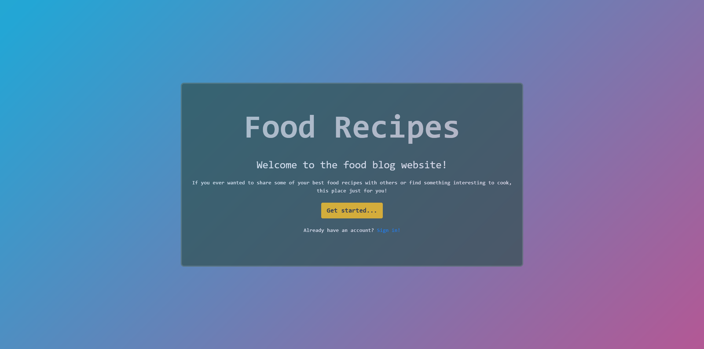
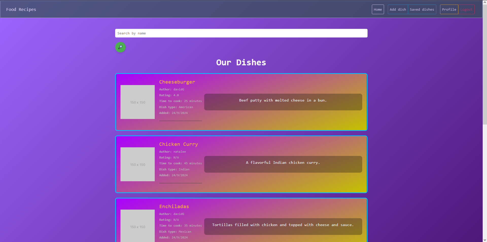

# Food Recipes Project

Django project, where you can share your best food recipes with other or find something interesting for yourself

## Check it out!

[Deployed project](https://food-recipes-xxy7.onrender.com)

### Installation

Python3 must be already installed

```
git clone https://github.com/dartomOOv/food-recipes.git
cd food-recipes
python -m venv venv
venv\Scripts\activate
pip install -r requirements.txt
python manage.py runserver
```

## Features

* Registration and login 
* Rating system on recipe page
* Save & remove buttons
* Tests already written

## 'env.sample' Explanation

* PGHOST, PGDATABASE, PGUSER, PGPASSWORD - for linking to the PostgreSQL database
* SECRET_KEY - for securing signed data
* DEBUG - to run the server with or without debug on (True/False)
### To use it in project, create '.env' file and put all of these variables in it with your own values

## Demo



